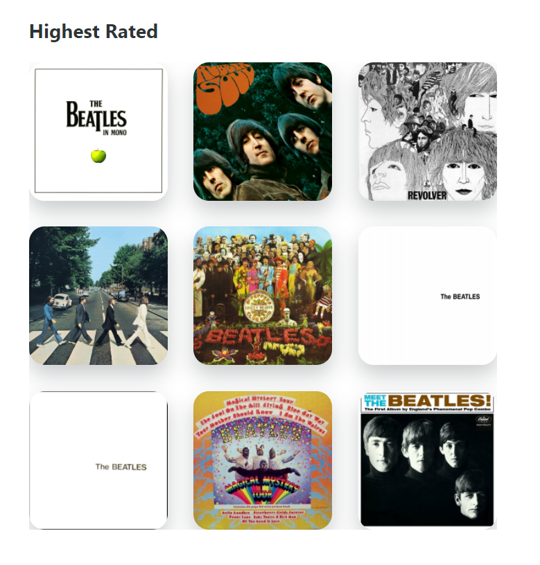
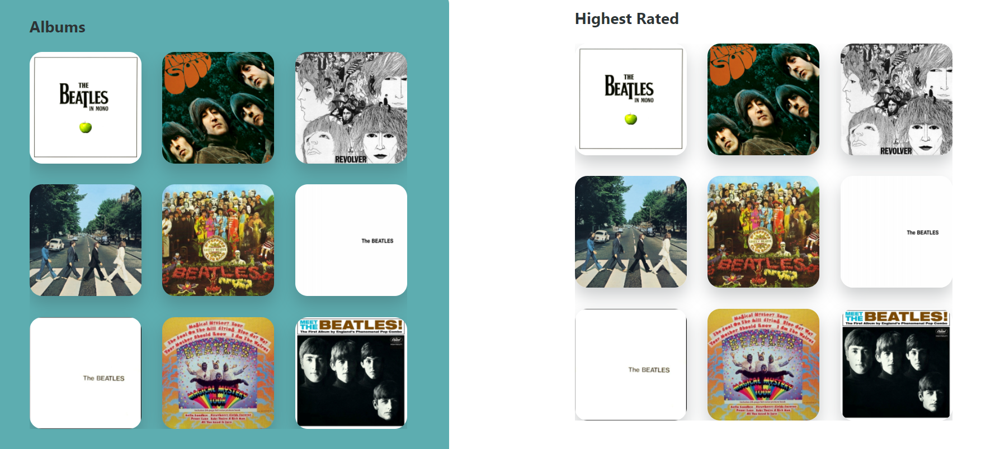

# Challenge: Props

In VS Code right click on the challenge.md file and click "Open Preview".

The aim of this challenge is to get you to practice using arrays and components.

You will need to reuse the DiscographyCardList component. and get it to look like the image below.

---

1. Reuse the DiscographyCardList component in App.jsx, you will need to give it "Highest Rated" as the title.

2. Create a variable for the highest rated albums. The aim now is to sort the array based on the intScore key on each of the album objects. The highest score should be first album displayed.

3. Slice the array so it only has 9 albums in it and pass this array to the component.

4. If both of your DiscographyCardList components are showing the same sorted albums like below. Do you have an idea why this is happening and how can we stop it?

**_HINT_**

- [MDN Sort](https://developer.mozilla.org/en-US/docs/Web/JavaScript/Reference/Global_Objects/Array/sort)
- [MDN Spread](https://developer.mozilla.org/en-US/docs/Web/JavaScript/Reference/Operators/Spread_syntax)

5. Can you Filter out any album objects that do not have an intScore key before you sort the array?
