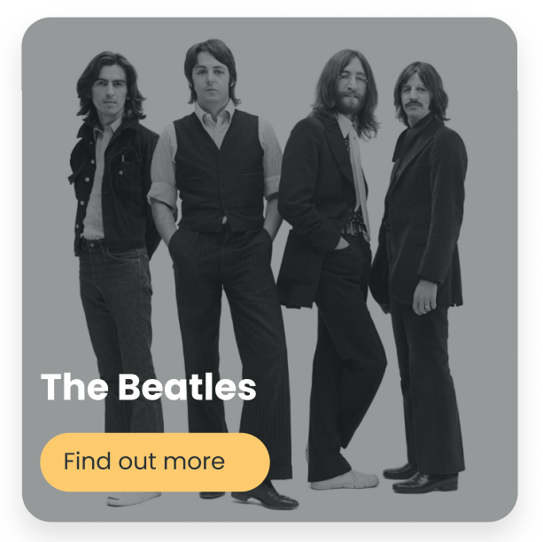

# Challenge: Props

In VS Code right click on the challenge.md file and click "Open Preview".

The aim of this challenge is to get you to practice using props.

You will need to create this component shown in the image below, style and render it in our App.jsx. You will need to pass in two props from src/data/artist.

---

**Focus on using props first then style it.**

1. Create the component and call it DiscoverArtistCard. You will need to create a folder, jsx and scss file for it. You will have to import it and render it in App.jsx.

2. The component needs two props from the artist object from the data folder. Can you pass strArtist and strArtistThumb into the component?

3. You will need to now use the props in the component.

- strArtist -> The artist's name
- strArtistThumb -> The artist's Img url

4. You need to import your Button into this component and give it "Find out more" text to display and make it have the secondary styles.

5. Its Time to style it :D

6. **EXTENSION** Go to this [code-pen](https://codepen.io/charlie-robin/pen/RwVyNvO) Can you apply the dark overlay to your component?
