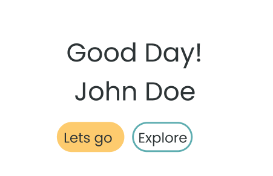

# Challenge: Components

In VS Code right click on the challenge.md file and click "Open Preview".

The aim of this challenge is to create two button components as shown in the image below, style them and then render them in our App.jsx.

---

1. Create two buttons components called ButtonExplore and ButtonLetsGo. You will need to create a folder, jsx and scss file for each of the buttons.

2. When you have created the files you will need to write the JSX and style the components.

- ButtonLetsGo should have a background color the same as the `$color-secondary;` variable from our variables.scss file.
- ButtonExplore should have a border the same color as our `$color-primary;` variable from our variables.scss file.

3. You need to Import your buttons and render them in App.jsx. Can you get them side by side? Flexbox? Grid?

4. **EXTENSION** Can you hide them for devices over 992px?
