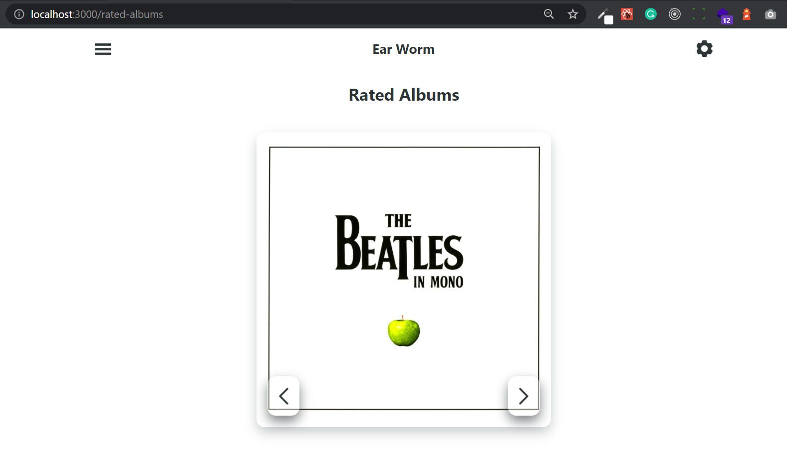
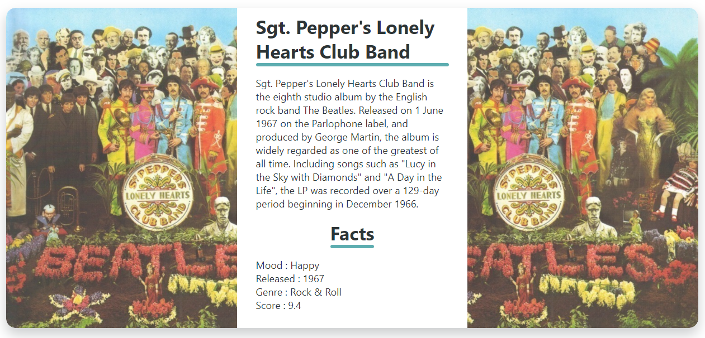

# Challenge: Routing

In VS Code right click on the challenge.md file and click "Open Preview".

## Challenge 1 Brief:

The aim of this challenge is to get you to practice adding routing to a project.

You will need to set a new link to "/albums/rated". You will need to set a new route in the app to reuse the AlbumGallery container. You will need to give it different props though.

In the image below you can see that when you go to http://localhost:3000/albums/rated it displays the AlbumGallery container but it has been given different props.

---

## Todo

1. Update The NavMenu component to link to the correct page.

2. Add a new Route to the Switch inside the App.

3. It is up to you to put the rest of the pieces together. Which container can we re use? What props need to given to this page?

_Hint If it is only going to /albums have a look at the [exact](https://reactrouter.com/web/api/Route/exact-bool) prop for the Route component_

---

## Challenge 2 Brief:

The aim of this challenge is to get you to practice using queryParams.

You will have the AlbumInfo container set up and should be logging the queryParams to the console. You need to use these params to find the correct album object from the albumsArr prop. Once you have found it you need use its data to replace the placeholders in the current JSX.

In the image below you can see that when you go to http://localhost:3000/album/2109696 it displays the AlbumInfo container and it is the correct data related to that album id.

---

## Todo

1. Use the id from the query params to find the album you need from the albumsArr prop.

2. Use the data on the object to populate the:

- Images src and alt attributes
- Title
- Text content
- Fact List

3. Can you shorten the text, it needs to be over 300 characters and cut to the last sentence over this word count.

4. EXTENSION: What happens if you go to http://localhost:3000/album/2185705 ? Do you have a bug?

_Hint [Optional Chaining](https://developer.mozilla.org/en-US/docs/Web/JavaScript/Reference/Operators/Optional_chaining) && [Nullish Coalescing](https://developer.mozilla.org/en-US/docs/Web/JavaScript/Reference/Operators/Nullish_coalescing_operator)_
