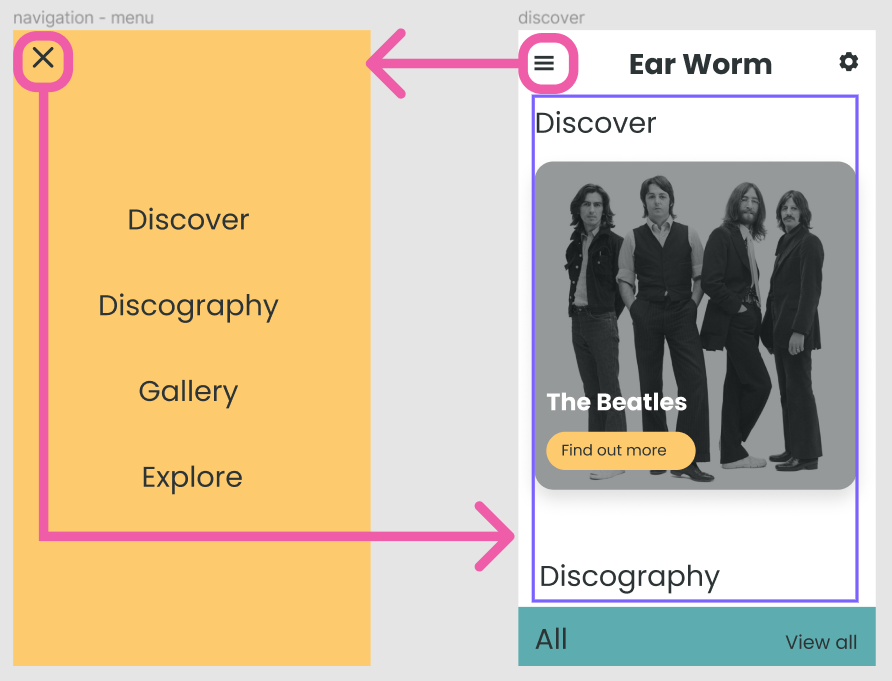
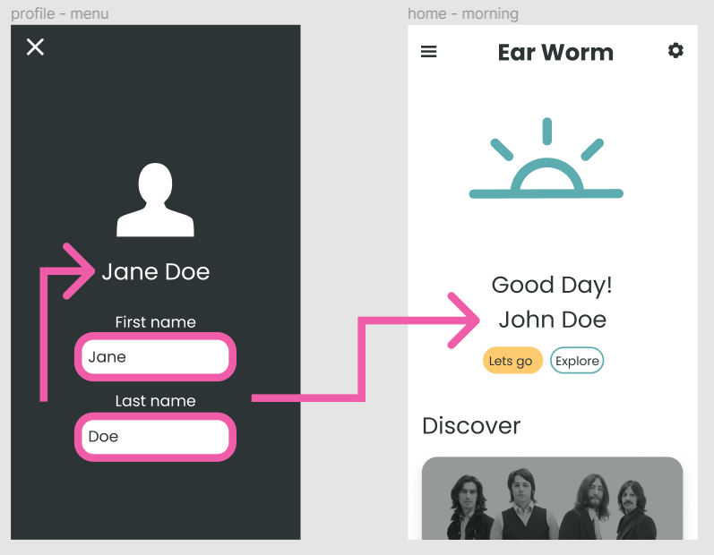

# Challenge: Functions as Props

In VS Code right click on the challenge.md file and click "Open Preview".

## Brief

The aim of this challenge is to get you to practice using functions as props and state to show and hide a component.

You will need to create a NavMenu component. You will need to update the Nav component so that when the menu icon is clicked it triggers the NavMenu to show. You will need to use functions as props to pass the NavMenu function to hide it.

In the image below you can see the current component and the what it needs to look like after the button has been clicked.

**The menu icon is only displayed below 992px**

---

## Todo

**Focus on using functions as props first then style it.**

1. Create a NavMenu menu component.

- The black cross image is in src/assets/images/black-cross.png.
- The menu items are Discover, Discography, Gallery and Explore.

3. Add conditional State to the Nav and display the NavMenu based on this.

4. Write a function to toggle the conditional state in Nav and hook it up to the nav menu icon.

5. It is up to you to put the rest of the pieces together. How can you pass the function to update state to the NavMenu? How do you get a function to run onCLick?

6. Style the NavMenu.

---

## **EXTENSION** : Brief

This is optional. The aim is to get you to practice using functions as props and state to show capture user input and store it in state.

You need to add inputs to the SettingsMenu component to allow the user to update the user object in App.jsx. You will need two inputs so you can update both firstName and lastName key on the object.

In the image below you can see the current component and the what it needs to look like after text has been entered to both inputs.

---

## Todo

1. Add two inputs to the SettingsMenu.

2. Set the user object to state.

3. Write a function to update the state. How can you handle updating object state?

_HINT [Cheat Sheet for Updating Objects and Arrays in React State](https://dev.to/andyrewlee/cheat-sheet-for-updating-objects-and-arrays-in-react-state-48np)_

4. Use functions as props to get the function to where it needs to be.

