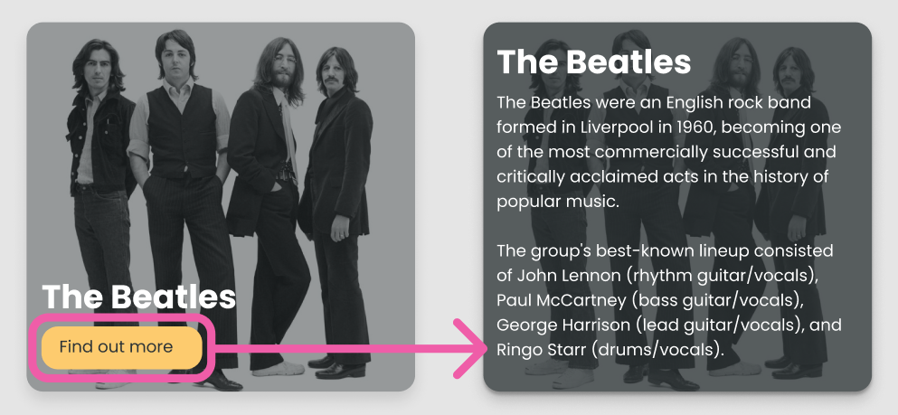

# Challenge: State

In VS Code right click on the challenge.md file and click "Open Preview".

## Brief

The aim of this challenge is to get you to practice using state to show/hide some JSX.

You will need to update the ArtistTile so that when the button is clicked it causes the state to change. This will cause it to show the title, cross and text about the artist rather then the title and the button. When the cross is clicked it should set it back to its original state.

In the image below you can see the current component and the what it needs to look like after the button has been clicked.

---

## Todo

1. Update the ArtistTile component so it accepts a text prop. Pass the `artist.strBiographyEN` as the value of this prop in App.jsx.

2. Add conditional State to the ArtistTile.

3. Write a function to toggle the conditional state.
   e.g. if its true it sets it to false and vice versa.

4. Add the onClick to the `
` that the `<Button/>` component is inside. **You will not be able to add it directly to the Button component, we will cover this soon.**

5. The cross is image is in src/assets/images/white-cross.png. Import it to the component.

6. It is up to you to put the rest of the pieces together. Can you get the text, title and cross to show when the state changes? Can you hook up the cross to set the state back?

- _Hint: Look in the SCSS file to see some scss classes you could use for the changes in state_

7. **EXTENSION** Can you tidy up the text? Can you make each sentence of the text its own p tag?

---
