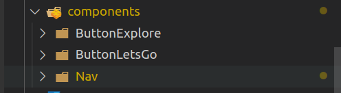

# Solution: Components

**Resist the urge the to look in these files if you can't come up with a solution yourself.**

It's always better to google, ask a fellow student or ask a coach. This is one way of solving the challenge not the only way to do it.

## Creating the button components

1. In the components folder create two folders, one for each button. Click the below link to see how they should look.



2. Within each of your button folders create a jsx file and a sass file for styling.

3. Create the function for each of your components - remember to export your component.

```jsx
const ButtonExplore = () => {
    return (

    )
}

export default ButtonExplore
```

4. Write the code for each of your buttons and add sass styling.

```jsx
import "./ButtonExplore.scss";

const ButtonExplore = () => {
  return <button className="button-explore">Explore</button>;
};

export default ButtonExplore;
```

```scss
@use "../../assets/sass/_variables.scss" as *;

.button-explore {
  min-width: 80px;
  padding: 10px 20px;
  margin: 0 10px;
  background-color: transparent;
  border-radius: 15px;
  border: 2px solid $color-primary;
}
```

```jsx
import "./ButtonLetsGo.scss";

const ButtonLetsGo = () => {
  return <button className="button-lets-go">Lets Go</button>;
};

export default ButtonLetsGo;
```

```scss
@use "../../assets/sass/_variables.scss" as *;

.button-lets-go {
  min-width: 80px;
  padding: 10px 20px;
  margin: 0 10px;
  background-color: $color-secondary;
  border-radius: 15px;
  border: none;
}
```

## Render your buttons in App.jsx

1. In App.jsx, import the two button components you have created.

```jsx
import ButtonLetsGo from "./components/ButtonLetsGo";
import ButtonExplore from "./components/ButtonExplore";
```

2. Render your two components within a section tag

```jsx
import "./App.scss";
import sunrise from "./assets/images/sunrise.png";
import sun from "./assets/images/sun.png";
import moon from "./assets/images/moon.png";
import Nav from "./components/Nav";
import ButtonLetsGo from "./components/ButtonLetsGo/ButtonLetsGo";
import ButtonExplore from "./components/ButtonExplore/ButtonExplore";

const App = () => {
  const user = {
    firstName: "John",
    lastName: "Doe",
  };

  const currentHour = new Date().getHours();
  let greetingImg = sunrise;
  let greetingTime = "Morning!";

  if (currentHour >= 12) {
    greetingImg = sun;
    greetingTime = "Afternoon!";
  }

  if (currentHour >= 18) {
    greetingImg = moon;
    greetingTime = "Evening!";
  }

  return (
    <>
      <div className="app">
        <Nav />
        <header className="greeting">
          
          <h1 className="greeting__heading">
            Good {greetingTime} <br /> {user.firstName} {user.lastName}
          </h1>
        </header>
        <section>
          <ButtonLetsGo />
          <ButtonExplore />
        </section>
      </div>
    </>
  );
};

export default App;
```

3. Add a class to the section container that contains the buttons you've just rendered.

```jsx
<section className="button-section">
  <ButtonLetsGo />
  <ButtonExplore />
</section>
```

4. Style the section in App.scss.

```scss
@use "./assets/sass/_variables.scss" as *;

.app {
  .greeting {
    text-align: center;

    &__heading {
      color: $color-black;
    }

    & > * {
      margin: 20px;
    }
  }
  .button-section {
    display: flex;
    margin: 20px auto;
    width: fit-content;
  }
}

@media screen and (min-width: 992px) {
  .app {
    max-width: 1200px;
    margin: 0 auto;
    display: grid;
    gap: 50px;
    grid-template-columns: repeat(2, 1fr);
    grid-template-rows: min-content;

    .greeting {
      text-align: left;
      display: flex;
      align-items: center;
      justify-content: center;

      &__img {
        height: 100px;
      }
    }

    .button-section {
      display: none;
    }
  }
}
```
