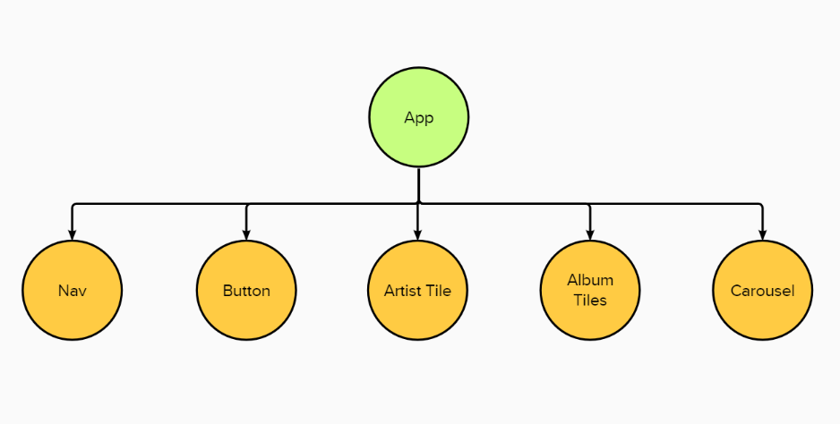
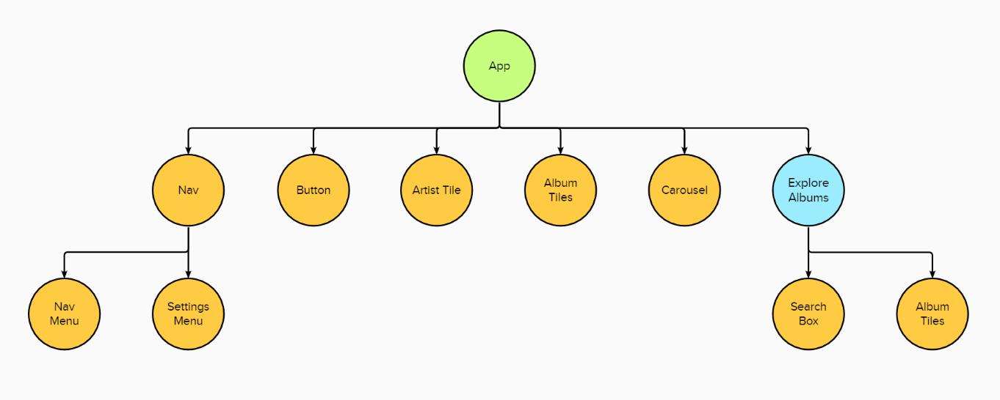

# Component Tree

This is a visual diagram of our application as we add components to it. You can see the what we start with and what we are working towards.

On this branch by the end of the challenge the project will have these components:

- Nav
- Button
- ArtistTile
- AlbumTiles
- Carousel
- NavMenu
- SettingsMenu
- SearchBox
- Router, Switch, Link and Route from react-router-dom

With these containers:

- ExploreAlbums
- Home
- AlbumInfo
- AlbumGallery

Home, AlbumInfo and AlbumGallery are different pages to route to in the project.

The paths will be:

- Home = "/"
- AlbumInfo = "/album/:id"
- AlbumGallery = "/albums"

## Starting Branch

## Completed Branch

---
